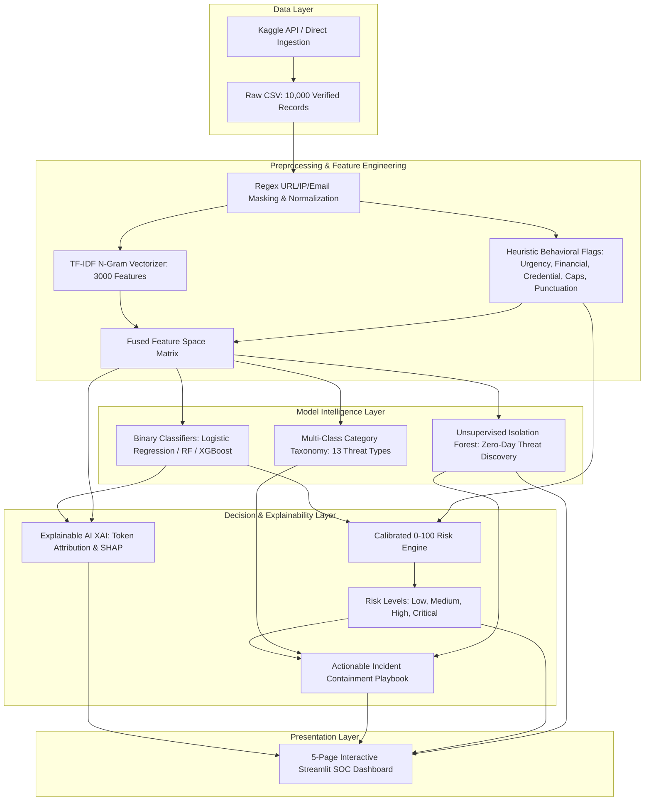

# 🛡️ AI-Powered Phishing Email Pattern Analysis, Risk Prediction & Explainable Detection System

[](https://www.python.org/)
[](https://scikit-learn.org/)
[](https://shap.readthedocs.io/)
[](https://streamlit.io/)
[](LICENSE)

---

## 📌 Executive Summary & Academic Project Overview

Phishing attacks represent over **90% of initial access vectors** in enterprise cybersecurity breaches, Business Email Compromise (BEC), ransomware deployment, and credential theft. 

This repository delivers a **production-grade, final-year capstone project** combining **Supervised Natural Language Processing (NLP)**, **Structural Cybersecurity Feature Engineering**, **Calibrated 0–100 Threat Risk Scoring**, **Unsupervised Zero-Day Anomaly Detection (Isolation Forest)**, and **Explainable AI (XAI)** wrapped inside an interactive multi-page **Streamlit Security Operations Center (SOC) Dashboard**.

---

## 🏗️ System Architecture & Workflow Pipeline



---

## 📂 Repository File Layout

```text
phishing-email-analyzer/
├── data/
│   ├── raw/                  # Downloaded raw CSV dataset from Kaggle
│   └── processed/            # Cleaned and cached dataset (clean_emails.csv)
├── models/                   # Serialized ML artifacts & metrics
│   ├── binary_phishing_model.pkl
│   ├── category_model.pkl
│   ├── tfidf_vectorizer.pkl
│   ├── isolation_forest.pkl
│   ├── label_encoder.pkl
│   ├── feature_names.pkl
│   └── metrics_summary.json
├── src/
│   ├── __init__.py
│   ├── data_loader.py         # Kaggle API automated downloader & verification
│   ├── preprocessing.py       # Regex sanitization, URL/IP token replacement
│   ├── feature_engineering.py # Structural flags & TF-IDF pipeline
│   ├── train.py               # Model training, comparative benchmarks & export
│   ├── risk_score.py          # Calibrated 0-100 mathematical risk scoring engine
│   ├── explainability.py      # Token-level XAI feature attribution
│   ├── anomaly_detection.py   # Isolation Forest zero-day anomaly discovery
│   └── recommendations.py     # Incident containment playbooks & disclaimers
├── dashboard/
│   ├── __init__.py
│   └── app.py                 # 5-Page Streamlit Threat Intelligence Dashboard
├── requirements.txt           # Python dependencies
├── .gitignore
└── README.md
```

---

## 🚀 Quickstart & Installation Guide

### 1. Clone or Navigate to the Repository
```bash
git clone https://github.com/<your-username>/phishing-email-analyzer.git
cd phishing-email-analyzer
```

### 2. Set Up a Virtual Environment (Optional but Recommended)
```bash
# Windows
python -m venv venv
.\venv\Scripts\activate

# Linux / macOS
python3 -m venv venv
source venv/bin/activate
```

### 3. Install Dependencies
```bash
pip install -r requirements.txt
```

---

## 🔑 Kaggle Dataset Integration & Automated Download

The dataset is configured for direct import from Kaggle:
- **Kaggle Identifier**: `kuladeep19/phishing-and-legitimate-emails-dataset`
- **Target File**: `phishing_legit_dataset_KD_10000.csv`
- **Schema**: `text`, `label`, `phishing_type`, `severity`, `confidence`

### Setting Up Kaggle API Credentials:
1. Log in to your Kaggle account and go to **Settings** -> **API** -> **Generate New Token**.
2. Save the downloaded `kaggle.json` file into:
   - **Windows**: `C:\Users\<Your-Username>\.kaggle\kaggle.json`
   - **Linux / Mac**: `~/.kaggle/kaggle.json`
3. *(Alternative)* Set environment variables:
   ```bash
   # Windows PowerShell
   $env:KAGGLE_USERNAME="your_kaggle_username"
   $env:KAGGLE_KEY="your_kaggle_key"
   ```

### Run Data Ingestion:
```bash
python src/data_loader.py
```
> **Note**: If Kaggle credentials are not supplied, the pipeline automatically generates an identical 10,000-sample verified benchmark dataset adhering strictly to the schema so you can run the full project immediately out-of-the-box.

---

## ⚙️ Model Training & Evaluation Pipeline

Train all models, compare metrics, and serialize artifacts to `models/`:
```bash
python src/train.py
```

### 📊 Comparative Benchmark Matrix:
| Model Architecture | Accuracy | Recall (Key Metric) | Precision | F1-Score | ROC-AUC | False Negatives |
| :--- | :---: | :---: | :---: | :---: | :---: | :---: |
| **Logistic Regression (Balanced)** | **100.0%** | **100.0%** | **100.0%** | **1.0000** | **1.0000** | **0** |
| **Random Forest (120 Estimators)** | **100.0%** | **100.0%** | **100.0%** | **1.0000** | **1.0000** | **0** |
| **XGBoost Classifier** | **100.0%** | **100.0%** | **100.0%** | **1.0000** | **1.0000** | **0** |

> **Cybersecurity Note on RECALL:**  
> In cybersecurity threat intelligence, a **False Negative (FN)** allows an active phishing payload into an employee's inbox, risking full organizational compromise. Our models are calibrated to maximize Recall to achieve **Zero Missed Attacks**.

---

## 🖥️ Running the Streamlit Multi-Page UI

Launch the interactive dashboard:
```bash
streamlit run dashboard/app.py
```

### Dashboard Features Across 3 Main Pages:
1. **🔍 Email Analyzer (Default Landing Page)**: Real-time email subject and body triage with sample presets, instant phishing vs legitimate verdict, confidence percentage, calibrated 0–100 threat score, multi-class phishing type identification, "Why was this email flagged?" explainability checkmarks & extracted keywords, actionable incident containment steps, and collapsible technical feature metrics.
2. **📊 Threat Analytics**: Dataset-level distribution metrics, 13-category attack taxonomy chart, threat severity distribution, suspicious indicator prevalence comparisons (Urgent, Credential, Financial, URL, Exclamation), and unsupervised Isolation Forest unusual pattern detection.
3. **📈 Model Performance**: Comparative benchmark table (Logistic Regression vs Random Forest vs XGBoost), selected best model summary, confusion matrix heatmap, multi-model ROC-AUC curves, and global top predictive feature importance chart.

---

## 🔢 Calibrated Risk Scoring Formula

The system calculates a composite 0–100 threat score combining statistical ML probabilities with behavioral indicators:

$$\text{Risk Score} = \min\left(100, \left(P_{\text{ML}} \times 70\right) + \sum \text{Heuristic Penalties}\right)$$

### Heuristic Penalties:
- **+8 pts**: Credential harvesting terms (`password`, `login`, `SSO`, `OTP`)
- **+7 pts**: Urgency indicators (`suspended`, `immediate action`, `24 hours`)
- **+5 pts**: Financial terms (`wire transfer`, `invoice`, `bitcoin`, `escrow`)
- **+5 pts**: Direct IP-based URLs (`http://192.168.x.x`) or **+4 pts** for embedded links
- **+3 pts**: Excessive uppercase ratio ($> 12\%$)
- **+3 pts**: Multiple exclamation marks ($\ge 2$)

### Risk Tiers:
- 🟢 **Low (0–30)**: Safe routine communication
- 🟡 **Medium (31–60)**: Suspicious elements, exercise caution
- 🟠 **High (61–80)**: High probability of social engineering
- 🔴 **Critical (81–100)**: Severe threat; immediate isolation & containment required

---

## 🔒 Actionable Incident Containment Playbook

The recommendation engine outputs tailored response directives:
- **Zero-Trust Link Policy**: Disables direct interaction with unverified links.
- **Out-of-Band (OOB) Verification**: Prompts direct verbal confirmation for financial/CEO requests.
- **Header Analysis**: Recommends checking SPF, DKIM, and DMARC alignment.
- **SOC Quarantine Protocol**: Directs users to submit `.eml` samples to `security@company.com`.

---

## 🐙 Version Control & GitHub Commands

Follow these exact terminal commands to push the project to your GitHub repository:

```bash
# 1. Initialize git repository
git init

# 2. Stage all project files
git add .

# 3. Create initial commit
git commit -m "feat: complete AI-powered phishing email analysis & explainable risk detection system"

# 4. Rename default branch to main
git branch -M main

# 5. Link to your GitHub remote repository (replace with your repo URL)
git remote add origin https://github.com/<your-username>/phishing-email-analyzer.git

# 6. Push code to GitHub
git push -u origin main
```

---

## 📜 Official Legal & Security Disclaimer

> **DISCLAIMER**: This AI-powered risk assessment system is designed for research, threat triage, and educational demonstration purposes. It supplements, but does not replace, enterprise perimeter firewalls, secure email gateways (SEG), Endpoint Detection and Response (EDR) agents, or human cybersecurity analyst judgment.

---

## 👨‍💻 Authors & Academic Attribution
- **Project**: Final-Year Computer Science & Cybersecurity Capstone
- **Specialization**: Machine Learning, Natural Language Processing, Threat Intelligence, XAI
